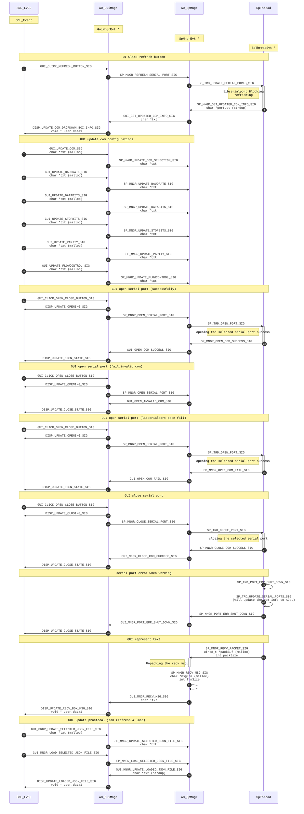

# Interactive Events

```mermaid
%%{
  init: {
    'themeVariables': {
      'fontFamily': 'Consolas, monospace',
      'noteFontFamily': 'Consolas, monospace',
      'actorFontFamily': 'Consolas, monospace',
      'messageFontFamily': 'Consolas, monospace'
    }
  }
}%%
sequenceDiagram
    autonumber
    participant SDL_LVGL
        note over SDL_LVGL: SDL_Event
    participant AO_GuiMngr
        note over AO_GuiMngr: GuiMngrEvt *
    participant AO_SpMngr
        note over AO_SpMngr: SpMngrEvt *
    participant SpThread
        note over SpThread: SpThreadEvt *

    Note over SDL_LVGL, SpThread: UI Click refresh button
    SDL_LVGL ->> AO_GuiMngr: GUI_CLICK_REFRESH_BUTTON_SIG
    AO_GuiMngr ->> AO_SpMngr: SP_MNGR_REFRESH_SERIAL_PORT_SIG
    AO_SpMngr ->> SpThread: SP_TRD_UPDATE_SERIAL_PORTS_SIG
        activate SpThread
            Note left of SpThread: libserialport Blocking<br/>refreshing
            SpThread ->> AO_SpMngr: SP_MNGR_GET_UPDATED_COM_INFO_SIG<br/>char *portLst (strdup)
        deactivate SpThread
    AO_SpMngr ->> AO_GuiMngr: GUI_GET_UPDATED_COM_INFO_SIG<br/>char *txt
    AO_GuiMngr ->> SDL_LVGL: DISP_UPDATE_COM_DROPDOWN_BOX_INFO_SIG<br/>void * user.data1

    Note over SDL_LVGL, AO_SpMngr: GUI update com configurations
    SDL_LVGL ->> AO_GuiMngr: GUI_UPDATE_COM_SIG <br/> char *txt (malloc)
    AO_GuiMngr ->> AO_SpMngr: SP_MNGR_UPDATE_COM_SELECTION_SIG<br/>char *txt

    SDL_LVGL ->> AO_GuiMngr: GUI_UPDATE_BAUDRATE_SIG<br/> char *txt (malloc)
    AO_GuiMngr ->> AO_SpMngr: SP_MNGR_UPDATE_BAUDRATE_SIG<br/>char *txt

    SDL_LVGL ->> AO_GuiMngr: GUI_UPDATE_DATABITS_SIG<br/> char *txt (malloc)
    AO_GuiMngr ->> AO_SpMngr: SP_MNGR_UPDATE_DATABITS_SIG<br/>char *txt

    SDL_LVGL ->> AO_GuiMngr: GUI_UPDATE_STOPBITS_SIG<br/> char *txt (malloc)
    AO_GuiMngr ->> AO_SpMngr: SP_MNGR_UPDATE_STOPBITS_SIG<br/>char *txt

    SDL_LVGL ->> AO_GuiMngr: GUI_UPDATE_PARITY_SIG<br/> char *txt (malloc)
    AO_GuiMngr ->> AO_SpMngr: SP_MNGR_UPDATE_PARITY_SIG<br/>char *txt

    SDL_LVGL ->> AO_GuiMngr: GUI_UPDATE_FLOWCONTROL_SIG<br/> char *txt (malloc)
    AO_GuiMngr ->> AO_SpMngr: SP_MNGR_UPDATE_FLOWCONTROL_SIG<br/>char *txt

    Note over SDL_LVGL, SpThread: GUI open serial port (successfully)
    SDL_LVGL ->> AO_GuiMngr: GUI_CLICK_OPEN_CLOSE_BUTTON_SIG
    AO_GuiMngr ->> SDL_LVGL: DISP_UPDATE_OPENING_SIG
    AO_GuiMngr ->> AO_SpMngr: SP_MNGR_OPEN_SERIAL_PORT_SIG
    AO_SpMngr ->> SpThread: SP_TRD_OPEN_PORT_SIG
        activate SpThread
            Note left of SpThread: opening the selected serial port success
            SpThread ->> AO_SpMngr: SP_MNGR_OPEN_COM_SUCCESS_SIG
        deactivate SpThread
    AO_SpMngr ->> AO_GuiMngr: GUI_OPEN_COM_SUCCESS_SIG
    AO_GuiMngr ->> SDL_LVGL: DISP_UPDATE_OPEN_STATE_SIG

    Note over SDL_LVGL, AO_SpMngr: GUI open serial port (fail:invalid com)
    SDL_LVGL ->> AO_GuiMngr: GUI_CLICK_OPEN_CLOSE_BUTTON_SIG
    AO_GuiMngr ->> SDL_LVGL: DISP_UPDATE_OPENING_SIG
    AO_GuiMngr ->> AO_SpMngr: SP_MNGR_OPEN_SERIAL_PORT_SIG
    AO_SpMngr ->> AO_GuiMngr: GUI_OPEN_INVALID_COM_SIG
    AO_GuiMngr ->> SDL_LVGL: DISP_UPDATE_CLOSE_STATE_SIG

    Note over SDL_LVGL, SpThread: GUI open serial port (libserialport open fail)
    SDL_LVGL ->> AO_GuiMngr: GUI_CLICK_OPEN_CLOSE_BUTTON_SIG
    AO_GuiMngr ->> SDL_LVGL: DISP_UPDATE_OPENING_SIG
    AO_GuiMngr ->> AO_SpMngr: SP_MNGR_OPEN_SERIAL_PORT_SIG
    AO_SpMngr ->> SpThread: SP_TRD_OPEN_PORT_SIG
        activate SpThread
            Note left of SpThread: opening the selected serial port success
            SpThread ->> AO_SpMngr: SP_MNGR_OPEN_COM_FAIL_SIG
        deactivate SpThread
    AO_SpMngr ->> AO_GuiMngr: GUI_OPEN_COM_FAIL_SIG
    AO_GuiMngr ->> SDL_LVGL: DISP_UPDATE_OPEN_STATE_SIG

    Note over SDL_LVGL, SpThread: GUI close serial port
    SDL_LVGL ->> AO_GuiMngr: GUI_CLICK_OPEN_CLOSE_BUTTON_SIG
    AO_GuiMngr ->> SDL_LVGL: DISP_UPDATE_CLOSING_SIG
    AO_GuiMngr ->> AO_SpMngr: SP_MNGR_CLOSE_SERIAL_PORT_SIG
    AO_SpMngr ->> SpThread: SP_TRD_CLOSE_PORT_SIG
        activate SpThread
            Note left of SpThread: closing the selected serial port
            SpThread ->> AO_SpMngr: SP_MNGR_CLOSE_COM_SUCCESS_SIG
        deactivate SpThread
    AO_SpMngr ->> AO_GuiMngr: GUI_MNGR_CLOSE_COM_SUCCESS_SIG
    AO_GuiMngr ->> SDL_LVGL: DISP_UPDATE_CLOSE_STATE_SIG

    Note over SDL_LVGL, SpThread: serial port error when working
    SpThread ->> SpThread: SP_TRD_PORT_ERR_SHUT_DOWN_SIG
    SpThread ->> SpThread: SP_TRD_UPDATE_SERIAL_PORTS_SIG<br/>(Will update the com info to AOs.)
    SpThread ->> AO_SpMngr: SP_MNGR_PORT_ERR_SHUT_DOWN_SIG
    AO_SpMngr ->> AO_GuiMngr: GUI_MNGR_PORT_ERR_SHUT_DOWN_SIG
    AO_GuiMngr ->> SDL_LVGL: DISP_UPDATE_CLOSE_STATE_SIG

    Note over SDL_LVGL, SpThread: GUI represent text
    SpThread ->> AO_SpMngr: SP_MNGR_RECV_PACKET_SIG<br/> uint8_t *packBuf (malloc) <br/>int packSize
    activate AO_SpMngr
        Note left of AO_SpMngr: Unpacking the recv msg.
    deactivate AO_SpMngr
    AO_SpMngr ->> AO_SpMngr: SP_MNGR_RECV_MSG_SIG<br/>char *msgFrm (malloc)<br/>int frmSize<br/>
    AO_SpMngr ->> AO_GuiMngr: GUI_MNGR_RECV_MSG_SIG<br/>char *txt
    AO_GuiMngr ->> SDL_LVGL: DISP_UPDATE_RECV_BOX_MSG_SIG<br/>void * user.data1

    Note over SDL_LVGL, AO_SpMngr: GUI update proctocal json (refresh & load)
    SDL_LVGL ->> AO_GuiMngr: GUI_MNGR_UPDATE_SELECTED_JSON_FILE_SIG<br/>char *txt (malloc)
    AO_GuiMngr ->> AO_SpMngr: SP_MNGR_UPDATE_SELECTED_JSON_FILE_SIG<br/>char *txt

    SDL_LVGL ->> AO_GuiMngr: GUI_MNGR_LOAD_SELECTED_JSON_FILE_SIG
    AO_GuiMngr ->> AO_SpMngr: SP_MNGR_LOAD_SELECTED_JSON_FILE_SIG
    AO_SpMngr ->> AO_GuiMngr: GUI_MNGR_UPDATE_LOADED_JSON_FILE_SIG<br/>char *txt (strdup)
    AO_GuiMngr ->> SDL_LVGL: DISP_UPDATE_LOADED_JSON_FILE_SIG<br/>void * user.data1
```
